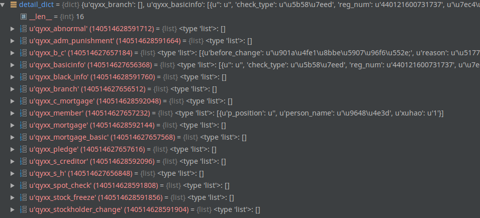
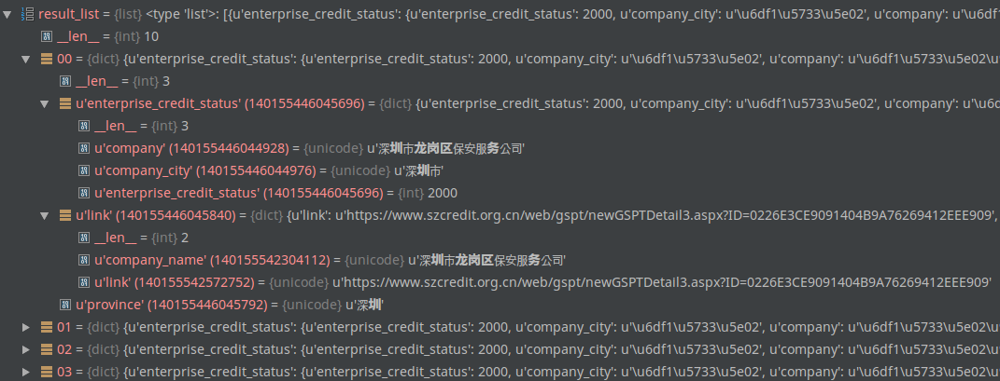
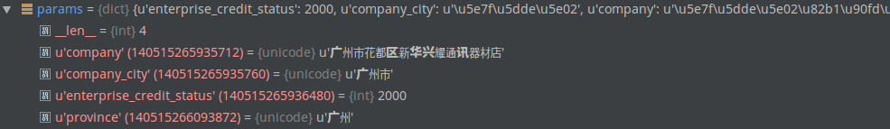

# 企业信用项目文档
----
## 目录结构

	spider/..						
		EnterpriseCreditCrawler/..	# 企业信用爬虫目录
			__init__.py
			common/..  				# 配置文件及自定义模块路径
			crawler/..				# 爬虫脚本的具体存放路径
			train_operator/..		# 保存验证码识别所需要的训练集（成为滑块后这个就没用了）
			documents/..			# 保存相关文档
			history/..				# 保存历史脚本（因网站更改而弃用的脚本）
			controller_query.py		# query调度脚本
			controller_data.py		# data调度脚本
			备查.txt

	备注：controller_query.py调用crawler目录下的*_query.py，controller_data.py调用crawler目录下的*_data.py。

## spider/EnterpriseCreditCrawler/common/..目录下各个脚本功能简介

* ### **captcha.py**

	内含对于图片验证码所需要用到的各种图像处理的方法，具体方法所实现的功能见具体函数功能介绍。

* ### **common.py**

	内含用于解析数据时所需要用到的几个函数，具体用法见函数功能介绍

* ### **conf.py**

	内含两个配置字典，tableDict是函数名与数据库表名的映射关系，provDict是省份与脚本名称前缀的映射关系。
	
* ### **image_recognition.py**

	深圳信用网的验证码识别接口脚本

* ### **page_parse.py**

	可用与页面解析的通用模块，不是所有的页面解析可以通用，视具体情况而定。

* ### **slide\_check\_code\_config_data.pkl**

	滑块验证码的模型

* ### **slide\_check\_code_recognition.py**
	
	滑块验证码的接口
	
* ### **uf_exception.py**
	
	自定义的异常类脚本

  
  
  

* ### **url_requests.py**

	重新封装后的requests请求模块

## spider/EnterpriseCreditCrawler/crawler/..目录下各个脚本功能简介

该目录下主要包含两类脚本，一类是后缀为query的的 \*_query.py，一类是后缀为data的 *_data.py。

* ### **\*_query.py**（以下简称query脚本）
	
	查询企业名称，获取返回的所有企业名单列表以及进行下一步查询所需要的链接或列表字典参数，例如搜索：腾讯，其返回结果如下：
		
		[
			{
				'company':'腾讯A',
				'detail': url1 (第一个企业的详情链接url，id或其他str，list，dict)
			},
			{
				'company':'腾讯B',
				'detail': url2 (第一个企业的详情链接url，id或其他str，list，dict)
			}
			...,
			{
				'company':'腾讯N',
				'detail': urlN (第一个企业的详情链接url，id或其他str，list，dict)
			}
		]

* ### **\*_data.py**（以下简称data脚本）

	根据由query脚本得到的结果链接或参数，做对应的请求（整个过程需要做网页请求分析），从而获取企业的详细信息。返回结果如下：
	
	

## spider/EnterpriseCreditCrawler/controller_query.py 脚本功能简介

该脚本由分布式中间件调用，目的是根据相应的省份调用相应的query脚本，并将query脚本返回的值加入特殊的状态码进行重组，重组后的结果如下：

	[
		{
			'enterprise_credit_status': {
									'company': '腾讯A'(实际查询的企业名称)，
									'company_city':'广东省',
									'enterprise_credit_status':2000
								},
			'detail':url1 (第一个企业的详情链接url，id或其他str，list，dict)，
			'province': '广东'
		},
	
		{
			'enterprise_credit_status': {
									'company': '腾讯B'(实际查询的企业名称)，
									'company_city':'广东省',
									'enterprise_credit_status':2000
								},
			'detail':url1 (第一个企业的详情链接url，id或其他str，list，dict)，
			'province': '广东'
		}
	]

	

备注：上图的“link”应改成“detail”

## spider/EnterpriseCreditCrawler/controller_data.py 脚本功能简介

该脚本由分布式中间件调用，目的是根据相应的省份调用相应的data脚本，并将data脚本返回的值加入特殊的状态码进行重组。

需要说明的是：data脚本在接收参数的同事接收了一个叫enterprise\_credit_status的字典，里面包含了状态码，而这个状态码的key需要一直带着走，最终根据具体情况返回。

注解：detail\_dict 是由data脚本查询企业返回的字典，而params是当前企业的查询状态，包含公司名称company，公司所在地company\_city，状态码enterprise\_credit_status, 省份province（这个字段由参数传入，已经没什么用了，但放着不影响数据的传递。）。最终将params和detail\_dict返回给分布式中间件。